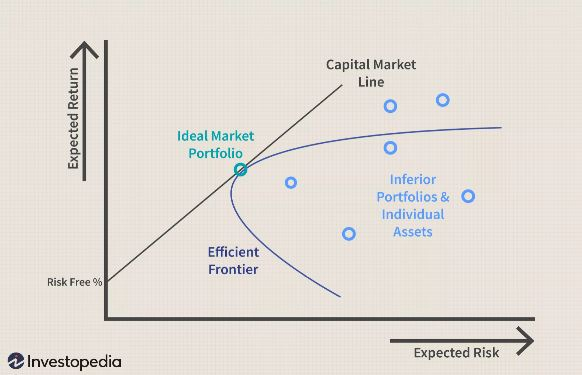

# Fab Four LLC - Professional Portfolio Optimizers

# Team 3 - Fab Four Portfolio Optimizers
## Team Members
* Steven Cherry II
* Fred Fu
* James Menacho
* Hamza Parekh
---

## "Optimized Asset Allocation for the Individual Investor"
 
* Our company's goal is to use Efficient Market Hypothesis to arrive at optimized portflios for the individual investor

**What are we trying to solve for?**

- [X] Can we show a verifiable uplift in our model portflio's sharpe ratio through the optimization process?
- [X] Does the notion of asset class diversification have merit?

---

## We get our Hands Dirty so you dont have to...

---

## We aim to solve for the Investment Issues of the Bulk of the Investment Public

* In 2019, Forbes reported that 78% of American workers lived paycheck to paycheck [^1]
* Also in 2019, Bankrate reported that just 16% of Americans save more then 15% of their annual earnings - 21% save none [^2] 
* Thus far in 2020, Gallup finds 55% of Americans reporting that they own stock [^3] 
* The concept of Diversification. 50% of Americans don’t know if it’s better to invest in a single stock or a mutual fund [^4] 

### The Notion of the Efficient Frontier in the context of Modern Portfolio Theory

* MPT is based on the thought that investor portfolios can be optimized through diversification. "Portfolio Seection", 1952
* The Efficient Frontier is marked by portfolios that give the highest return for a given level of risk
* Efficient Frontiers will vary based on asset inputs and weightings
* The lowering of covariance between a given portfolio's securities will reduce portfolio standard deviation (risk) 
* Optimized portfolio are plotted on the EF line.
* Portfolios that are diversified tend to be closer to the EF line versus those that are not

### Monte Carlo Simulation
* Computational Algorithms that output numerical results after continual random sampling
* Monte Carlo relies on the concept of randomness to project outcomes that might otherwise be deterministic in principle

#### Fab Four, LLC Proprietary Process:

* Fetch Data from Sources Specific to Possible Assets
* Clean and Merge Data into one of our custom Dataframes
* Output Return Volatility Metrics on 1) Baseline 2) Max Return 3) Max Volatilty and 4) Optimized Portfolio
* Use Correlation Screens
* Forecast Return Outcomes via Monte Carlo Simulation

#### Investor "Game Day":

* Overview of EFM Theory and Hypothesis
* OutPut Dashboards to Visualize Aggregrated Data 
* Demonstration of Customized Portfoio

---

### Caveats to Theory/Constructs Used:
* Past Projecting Future Returns
* Data Integrity
* Data look-back/time-line versus Projected Data
* Monthly Rebalancing

* EFM issues:

    * Financial markets rarely fit the assumptions of mean-variance models.  i.e 1970s, 2000s (bond dominance) versus 
    1990s (stock)
    * The EF is thus a "moving target"

* Monte Carlo Issues: 

    * In order to have a robust MC, you need to have the following criteria which can be elusive in some cases:
    
      * There are enough samples to ensure accurate outcomes
      * The algorithm used is valid for what it is being modeled for
      * MC actually simulates the phenomenon in question
   
---

**Footnotes**

[^1]: Forbes, [Link](https://forbes.com/sites/zackfriedman/2019/01/11/live-paycheck-to-paycheck-government-shutdown/#b42d3964f10b) 
[^2]: Bankrate, [Link](https://bankrate.com/banking/savings/financial-security-march-2019/) 
[^3]: Gallup, [Link](https://news.gallup.com/poll/266807/percentage-americans-owns-stock.aspx) 
[^4]: CNBC.com, [Link](https://cnbc.com/2020/02/19/50percent-of-americans-dont-know-how-to-diversify-their-investments.html) 

